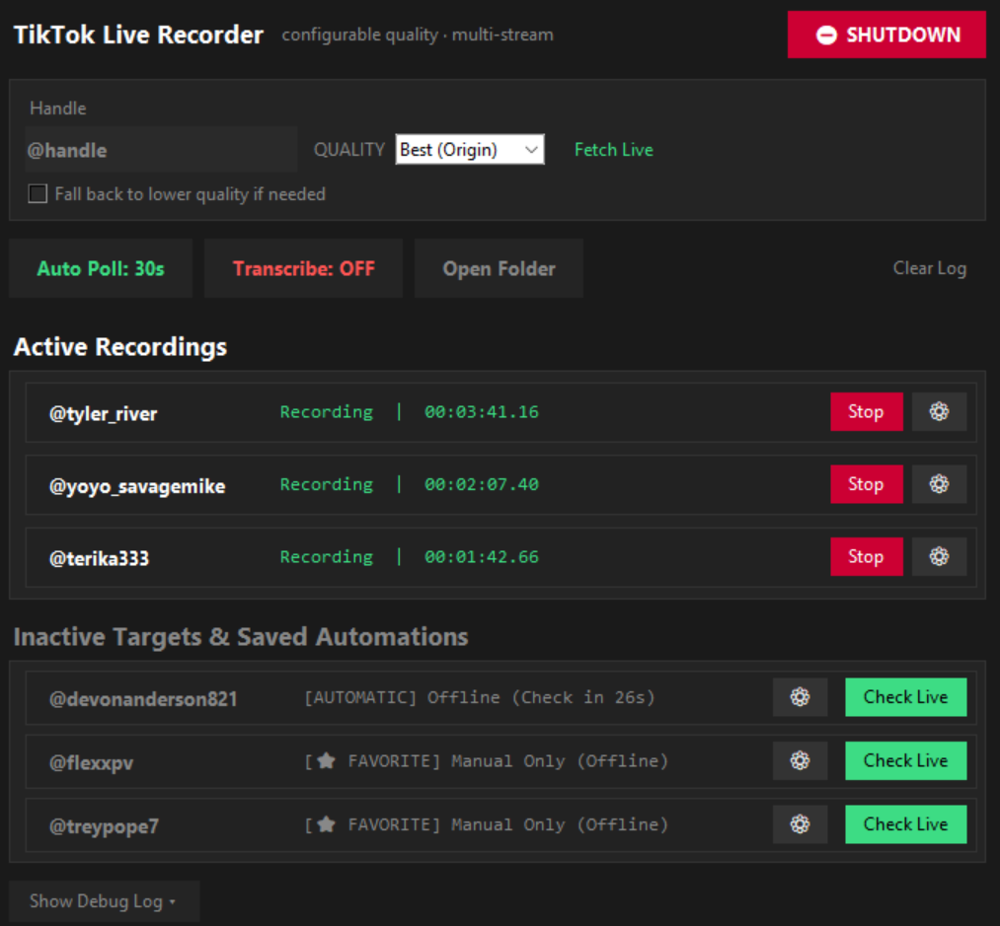

# 🎬 TikTok Live Recorder

A multi-stream, auto-monitoring TikTok Live recorder with live transcription.

Watches a list of creators, automatically starts recording the moment any of them goes live, rides out disconnects, lag, and more without losing footage, and (optionally) generates a rolling live transcript as the stream records.



---

## Features

### Recording engine
- Records live streams via FFmpeg, then automatically remuxes to `.mp4`
- Error-tolerant remux fallback for segments that end abnormally, so a rough disconnect doesn't cost you the whole capture
- Automatically stitches together short clips caused by brief connection drops, so one broadcast doesn't end up split into a dozen files.
- Startup recovery pass for any raw files left over from a crash or force-close

### Stream discovery & quality
- Fetches stream URLs directly via HTTP
- Ranks available stream variants and always selects the highest quality tier
- Refuses to start a recording on a low quality stream without permission
- Optional cookie support for authenticated fetches

### Reliability
- Automatic reconnect with a capped retry count
- Two-phase stream revival after a drop: fast re-checks immediately after disconnect, then a longer extended recovery window
- Tracks known-dead stream URLs so it won't loop on a source that just failed
- Distinguishes "connection hiccup" from "creator actually went offline"

### Multi-user automation
- Persistent watchlist that survives app restarts
- Per-target monitoring mode: actively polled, or saved without polling
- Global and per-target polling intervals
- Optional scheduled monitoring windows (e.g. only check between set hours)

### Live transcription
- Optional live transcription during recording using a local Whisper model (via `faster-whisper` — see Requirements)
- Writes a rolling transcript file alongside the recording as it updates

### Interface
- Desktop GUI showing active recordings and monitored/inactive targets separately
- Manual URL/username entry alongside automated monitoring

---

## Requirements

- Python 3.x
- [FFmpeg](https://ffmpeg.org/download.html) installed and on your PATH
- Windows (current build relies on Windows-specific APIs)
- Optional, for live transcription: [faster-whisper](https://github.com/SYSTRAN/faster-whisper) (installed via `requirements.txt`). Uses a CUDA GPU if available and falls back to CPU automatically — CPU transcription works but is noticeably slower.

## Installation

```bash
git clone https://github.com/RossW1738/TikTok-Live-Capture.git
cd TikTok-Live-Capture
pip install -r requirements.txt
python tiktok-live-capture.py
```

Transcription is optional — if you don't plan to use it, you can skip installing `faster-whisper` and leave the `Transcribe` toggle off in the app.

## Configuration

Recording output directory, log directory, and other paths are set at the top of the script. 

If you want authenticated fetches, drop your session cookies into `cookies.json` in the data directory.

## Where files go

By default everything lives under `~/TikTokLiveRecorder` (your home directory), set at the top of `tiktok-live-capture.py` via `BASE_DIR`. Nothing here is configurable from the app itself — if you want a different location, edit `BASE_DIR` before running.

```
~/TikTokLiveRecorder/
├── data/
│   ├── monitored_targets.json   # your watchlist — written on first launch, even if empty
│   ├── quality_settings.json    # written the first time you touch a quality setting in the UI
│   └── cookies.json             # optional, never created automatically — you add this yourself
├── recordings/
│   ├── _ORPHAN_RECOVERED/       # raw files recovered from a crash or force-close land here
│   ├── _transcript_chunks/      # temporary per-recording audio chunks, auto-cleaned as they're transcribed
│   ├── tiktok_<user>_<timestamp>.mp4
│   └── <user>_<task>_transcript.txt   # only if transcription was on for that recording
└── logs/
    └── recorder_shutdown_logs_<timestamp>.txt   # only written on a normal shutdown
```

A few things worth knowing before your first run:
- `data/` and `recordings/` (including the empty `_ORPHAN_RECOVERED` folder) are created within the first second of launch, before you've added a single target or clicked anything.
- `logs/` is the exception — it's only created on a clean shutdown via the app's own exit flow. Force-closing the window or killing the process means no shutdown log gets written, and the folder may never appear.

## Usage

- Add a username to start auto-monitoring — the app will record automatically whenever they go live. Links are accepted.
- Adjust polling interval and per-target schedules from the settings panel.

---

## Disclaimer

This project is not affiliated with, endorsed by, or sponsored by TikTok. It's intended for personal archival use. Use responsibly and in accordance with TikTok's Terms of Service.

## License

MIT